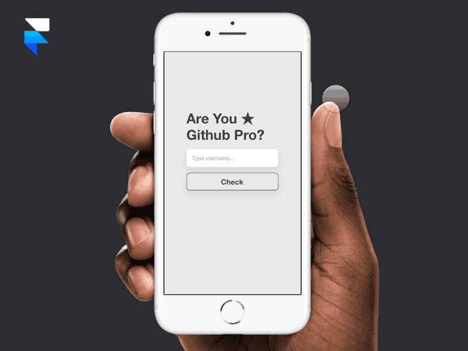

# Are You Github Pro?



Demo: https://are-you-github-pro.sonnylab.com/

## Background

Github just recently changed its pricing, and now we can create unlimited private repo for free. In addition, paid users will have `PRO` label under their profile.

## What is it?

Are You Github Pro is a simple webapp that check whether you're a github pro or not.

## Usage

input github username and click check.

## Installation

```
yarn
yarn run dev
```

## Roadmap

- [x] check pro user from username
- [x] deploy to server
- [x] new interaction design prototype
- [ ] update the webapp to follow prototype

## LICENSE

MIT Licensed
